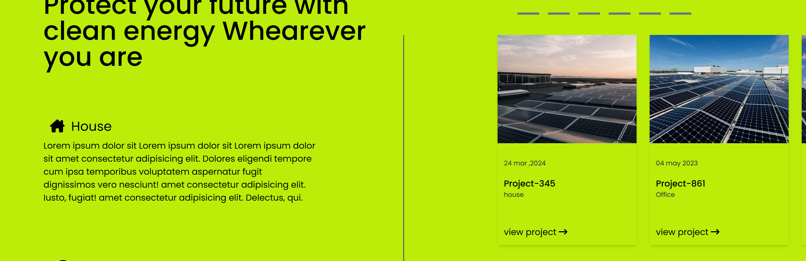
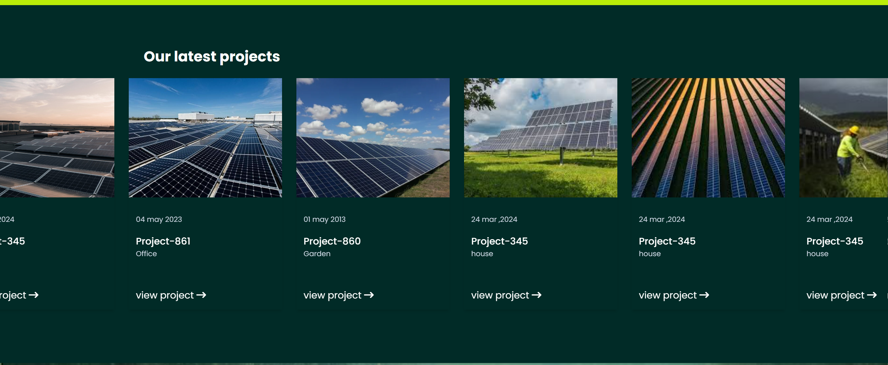

# Ronar Energy 🌱

Welcome to **Ronar Energy** – a beautifully designed and eco-friendly web project showcasing renewable energy solutions. This project is built using **HTML** and **Tailwind CSS** to create a clean, responsive, and modern user interface. 

---

## 🌟 Demo

Here's a sneak peek of **Ronar Energy**! 🎉





---

## 🛠️ Features

- Fully responsive design
- Clean and modern UI
- Built with Tailwind CSS for easy customization
- Fast and lightweight

---
## 🧰 Built With

-   **HTML**
-   **Tailwind CSS** 
---

## 🚀 Quick Start

Follow these steps to clone the repository and get the project running on your local machine:

1. **Clone the repository**:

   ```bash
   git clone https://github.com/yourusername/ronar-energy.git
  ```bash
	    cd ronar-energy